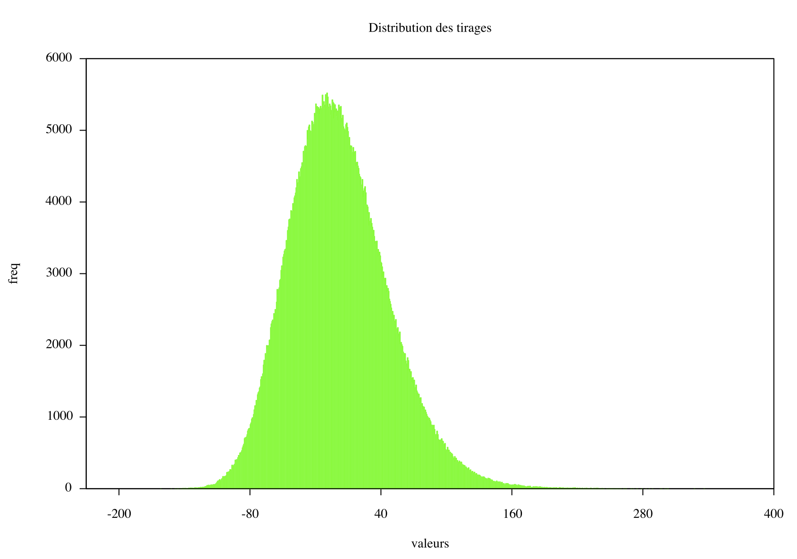

# VaRCL #

[](https://travis-ci.org/paraita/var-monte-carlo-opencl)


VaRCL is an OpenCL implementation of [VaR](http://en.wikipedia.org/wiki/Value_at_risk) [Monte-Carlo](http://en.wikipedia.org/wiki/Monte_Carlo_methods_in_finance) calculation.

## Installation ##

VaRCL is known to work on GNU/Linux and OSX 10.8.

### Dependencies ###

VaRCL requires an OpenCL capable device (>= OpenCL 1.0). It has been successfully tested with an NVidia Tesla C2050, Geforce 330M and AMD HD 5770.

It depends on:
* the Boost lib
* OpenCL driver

Optionally you can install:
* Doxygen (to generate the documentation)
* Gnuplot (to display the P&L distribution)


#### Compilation ####

You can compile VaRCL using the Makefile in the code folder. To compile VaRCL, just:
```bash
make
```

If you want to generate the documentation reference:
```bash
make doc
```

And if you want to plot the resulting P&L distribution:
```bash
make plot
```

It should look like this:


## Usage ##

Once compiled, you will find the binary in the code/bin folder. From within the code folder:
```bash
./bin/varcl
```

VaRCL should be called from the code folder, as just shown (This should be fixed later on).

It will give you an inline help on how to use VaRCL.

### Usage examples ###

Run VaRCL on the first 10 positions of CAC40 on the 5/8/13 with a confidence of 99% for tomorrow, using 983040 samples:
```bash
./bin/varcl -c 0.99 -n 983040 -p portefeuille.csv -t 1
```

Run VaRCL on the full CAC40 with the same parameters, allowing debug mode:
```bash
./bin/varcl -c 0.99 -n 983040 -p portefeuille-CAC40.csv -t 1 -b
```
Debug mode allow to save the P&L distribution in a file called tirages.data that can be used with gnuplot.

